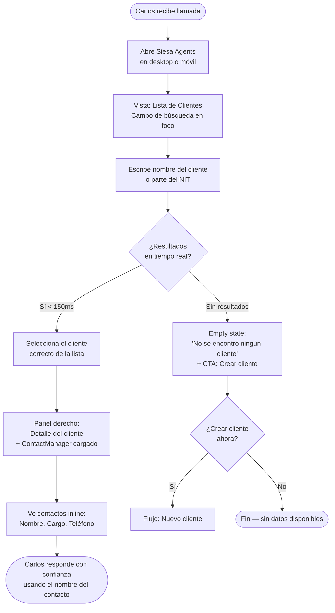
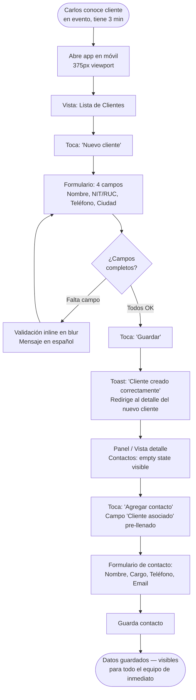
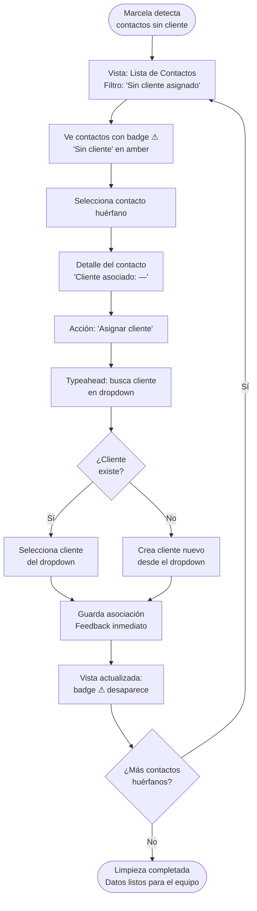
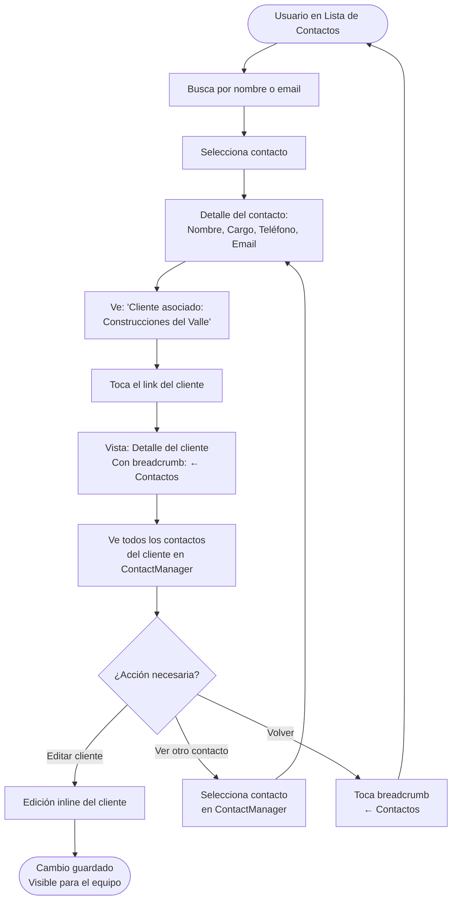

# UX Design Specification Siesa-Agents

**Author:** SiesaTeam
**Date:** 2026-03-12

---

<!-- UX design content will be appended sequentially through collaborative workflow steps -->

## Executive Summary

### Project Vision

A lightweight web SPA for managing clients and contacts, designed for commercial and support teams in small and mid-sized B2B companies. The system solves the critical problem of fragmented data across disconnected systems (Excel, phone contacts, emails) by unifying both entities in a single place with a first-class bidirectional relationship between them.

The defining UX principle: **the user never leaves their current context to see the related entity.** Client records display their contacts inline. Contact records display their client inline. Navigation is fluid and contextual — no unnecessary screen jumps.

### Target Users

| Persona | Role | Core Need | Primary Device |
|---------|------|-----------|----------------|
| **Carlos** (32) | Sales Executive | Find a contact in < 30 seconds during an active call | Desktop + Mobile |
| **Marcela** (38) | Commercial Coordinator | Single panel to clean duplicates, reassign contacts, maintain data quality | Desktop |
| **Diego** | Commercial Manager | Does not use directly — success is the team adopting it without complaints | N/A |

**Carlos's "aha" moment:** He searches a client name mid-call, gets all contacts (name, role, phone) before he finishes typing, and answers confidently using the caller's name.

**Marcela's "aha" moment:** She makes a change and it's immediately live for the whole team — no email, no Excel link, no waiting.

### Key Design Challenges

1. **Speed under pressure** — Carlos needs information in seconds while on an active call. Every additional click or screen transition has a real cost. The search experience must be the fastest path to information, not a secondary affordance.

2. **Bidirectional navigation without context loss** — The Client ↔ Contact relationship must be navigable in both directions without losing track of where you came from. The user should always feel oriented.

3. **Mobile-first form experience** — Journey 2 (registering a new client from the parking lot) requires a creation form that works on a 375px viewport with a virtual keyboard active. Fields must be minimal and fast to complete.

4. **Zero-training adoption** — Diego approves the system if the team adopts it without documentation or onboarding. The UI must be self-describing — no tooltips or manuals needed for Carlos-level tasks.

### Design Opportunities

1. **Search-first UX** — The client search can be the most prominent element on the main screen, not a secondary input buried in a header. Making search central reflects how the app will actually be used.

2. **Inline contact management** — Adding, editing, and disassociating contacts directly from the client detail view (without modals requiring full navigation) is the key differentiator of the experience.

3. **Visual data quality cues** — Subtle visual indicators for contacts without an assigned client give Marcela immediate visibility for her maintenance workflow without requiring a dedicated admin panel.

## Core User Experience

### Defining Experience

The defining experience of Siesa-Agents is **the sub-30-second contact lookup** — the moment
a sales executive receives a call, opens the app, types a client name, and has the full
contact list (name, role, phone) in front of them before the search is complete.

Everything else in the system serves this core loop. Client creation, contact management,
and data quality tools are necessary but secondary to the primary value: instant, confident
access to who to talk to at any given client.

The secondary defining experience is **inline relationship management**: from a client record,
contacts are visible and manageable without navigating away. From a contact record, the
associated client is immediately visible with a direct link back. The user is never
disoriented or forced to reconstruct context.

### Platform Strategy

| Dimension | Decision | Rationale |
|-----------|----------|-----------|
| Platform | Web SPA (React) | Accessible from any device without installation |
| Primary input | Mouse + keyboard | Carlos and Marcela work primarily at desktops |
| Secondary input | Touch (375px+) | Carlos's parking lot onboarding journey requires it |
| Offline | Not required (MVP) | Internal tool with reliable network access |
| Navigation | Client-side routing | No full page reloads — preserves context and speed |

### Effortless Interactions

The following interactions must require zero cognitive load — they must feel automatic:

1. **Search** — Typing into the client search field must feel like filtering in real time.
   No button to press, no delay felt, no wrong state between keystrokes.
2. **Contact access from client** — From any client record, contacts are visible immediately
   without a click to "expand" or "load". They are there.
3. **New contact association** — When creating a new contact, linking it to a client should
   be a single-field action (search + select), not a multi-step process.
4. **Edit in place** — Updating a contact's email or phone should not require opening a
   separate edit form. The fewer screens the better.

### Critical Success Moments

| Moment | User | Why it matters |
|--------|------|----------------|
| First contact lookup during a live call | Carlos | Defines immediate product value — either saves the moment or confirms the system works |
| First mobile client registration | Carlos | Validates the parking lot journey — if it fails here, mobile adoption dies |
| First duplicate detection + cleanup | Marcela | Proves data quality is manageable without Excel |
| First time change is seen by a colleague in real-time | Marcela | Eliminates the "send the updated Excel" mental model |

### Experience Principles

1. **Search is the homepage.** The primary entry point to the system is a search field,
   not a menu or a list. Getting to information fast is more important than showing
   everything at once.

2. **Context is sacred.** Users should never feel lost or have to reconstruct where they
   came from. Navigation between related entities preserves orientation.

3. **The relationship is the product.** The client ↔ contact association is not a
   secondary feature — it is the core of the UI. Visual design must make it central,
   not buried in a detail section.

4. **Mobile is a first-class citizen for creation, desktop for management.** Creation
   forms must be thumb-friendly. Admin/management tasks can assume a wider viewport.

5. **Zero explanation needed.** If a button needs a tooltip or a label requires context
   to understand, redesign the button or label. The system must work without onboarding.

## Desired Emotional Response

### Primary Emotional Goals

| User | Primary Feeling | What triggers it |
|------|-----------------|------------------|
| Carlos | **Confidence** | Finding the right contact before the question is even asked |
| Marcela | **Authority** | Making a change and seeing it reflected immediately across the team |
| Both | **Trust** | The system always has current, reliable data — not a "maybe" |

The system should feel like a competent, silent colleague — always available, never
wrong, never in the way.

### Emotional Journey Mapping

| Stage | Desired Emotion | Avoid |
|-------|-----------------|-------|
| First open / discovery | Clarity — "I immediately understand what this does" | Overwhelm, confusion |
| First search | Satisfaction — results appear as I type | Anxiety, waiting |
| Finding a contact | Relief + confidence — "got it, I can handle this call" | Frustration, doubt |
| Creating a new record | Ease — "this was faster than I expected" | Friction, second-guessing |
| Making a data correction | Empowerment — "done, everyone will see this now" | Uncertainty about save state |
| Returning after days away | Familiarity — "I know exactly what to do" | Relearning, disorientation |
| Something goes wrong | Reassurance — clear, calm feedback about what happened | Panic, ambiguity |

### Micro-Emotions

**Critical to achieve:**
- **Confidence over confusion** — Users act, not hesitate. Labels, CTAs and flows are
  unambiguous.
- **Trust over skepticism** — Data shown is always current. No stale states, no
  "refresh to see changes".
- **Accomplishment over frustration** — Every completed action (save, associate, delete)
  gives clear confirmation. The user knows it worked.

**Critical to avoid:**
- **Anxiety during search** — Any perceived lag or uncertain search state breaks Carlos's
  flow during a live call.
- **Disorientation after navigation** — Users must always know where they are and how
  to get back.
- **Doubt about data integrity** — If Marcela isn't sure a change saved, she'll maintain
  parallel systems (Excel) as backup.

### Design Implications

| Emotion | UX Design Approach |
|---------|--------------------|
| Confidence during lookup | Real-time search filtering (no submit button), results appear within 150ms of keystroke |
| Trust in data currency | Optimistic UI updates with immediate visual confirmation on save |
| Ease of creation | Minimal required fields, single-screen forms, no multi-step wizards for core flows |
| Empowerment for admin | Inline edit + delete with immediate feedback, no confirmation modals for low-risk edits |
| Calm during errors | Friendly, Spanish-language error messages with actionable guidance — never raw error codes |
| Familiarity on return | Consistent layout and navigation patterns — no surprise reorganizations between sessions |

### Emotional Design Principles

1. **Make the user look good.** Every interaction should make Carlos more competent in
   front of his clients, and Marcela more authoritative in front of her team.

2. **Silence is trust.** The system should not demand attention. No unnecessary
   notifications, no modals for confirmation on routine actions, no alerts that require
   dismissal. When it works, it's silent.

3. **Every action deserves a response.** No action should leave the user wondering if
   it worked. Saves confirm. Deletions confirm. Associations confirm. Fast and clear.

4. **Errors are rare and calm.** When something goes wrong, the message is in Spanish,
   explains what happened in one sentence, and tells the user what to do next.
   No stack traces, no "Error 500", no unexplained failures.

## UX Pattern Analysis & Inspiration

### Inspiring Products Analysis

#### Linear — Search-First Navigation & Zero Latency UX
**What it does well:** Global search is the primary navigation mechanism, not a secondary
feature. Results appear before you finish typing. The entire app feels instantaneous.
**Key pattern:** Command palette / instant search as the entry point to any entity.
**Relevance:** Carlos's core flow — type client name, get results immediately — should feel
exactly like Linear's search. No loading spinners, no submit buttons.

#### Notion — Inline Relationship Management
**What it does well:** Related entities (linked databases, relations) are visible and
editable inline within a record without navigating away. The parent-child relationship is
always visible and navigable in both directions.
**Key pattern:** Bidirectional relation display with inline management.
**Relevance:** The Client ↔ Contact relationship should work exactly like Notion's linked
database view — contacts visible inline on the client record, editable without leaving context.

#### HubSpot CRM (Contact Detail View)
**What it does well:** The contact detail shows the associated company prominently. The
company link is always visible, never buried. Editing individual fields doesn't require
opening a separate form — inline editing on hover.
**Key pattern:** Associated entity as a persistent, prominent sidebar element. Inline field
editing on hover/click.
**Relevance:** Contact detail view should show associated client prominently. Editing a
phone number or email should be a single click, not a form navigation.

#### Google Contacts — Mobile-First Creation
**What it does well:** Adding a new contact from mobile is fast — minimal required fields,
large touch targets, auto-advance between fields. The form is thumb-reachable.
**Key pattern:** Progressive disclosure on creation forms — show essential fields first,
optional fields below or on next step.
**Relevance:** Carlos's parking lot journey requires a creation form that works in under
2 minutes on a 375px viewport. Google Contacts' mobile creation pattern is the benchmark.

### Transferable UX Patterns

#### Navigation Patterns
- **Search-as-homepage (Linear)** — The client list view should lead with a prominent
  search field, not a table. Users navigate to records through search, not by scrolling
  a list.
- **Breadcrumb context trail (HubSpot)** — When navigating from Client → Contact, a
  visible back-link ("← Construcciones del Valle") preserves orientation and enables
  one-click return.

#### Interaction Patterns
- **Inline field editing (Notion / HubSpot)** — Click any field on a detail view to edit
  it in place. No "Edit" button that opens a separate form mode.
- **Optimistic UI updates (Linear)** — Changes appear immediately in the UI; the API
  call happens in the background. No waiting for server confirmation before the UI updates.
- **Typeahead client association (Notion relations)** — When associating a contact to a
  client, typing shows a filtered dropdown of existing clients. No separate lookup screen.

#### Visual Patterns
- **Card-based contact list within client record (HubSpot)** — Contacts shown as compact
  cards inside the client detail, each with name, role, and phone visible at a glance.
- **Unassigned indicator badge (Notion)** — Contacts without an associated client show
  a subtle visual indicator (e.g., a muted "Sin cliente" tag) visible in list views.
- **Empty state with CTA (Google Contacts)** — When a client has no associated contacts,
  the empty state includes an inline "Agregar contacto" button — not just a blank space.

### Anti-Patterns to Avoid

- **Modal-heavy workflows** — Opening a full modal to create or edit a contact breaks
  the inline experience. Avoid modals for CRUD operations that can be done inline.
- **Pagination on small datasets** — With up to 500 clients, pagination creates
  unnecessary friction. Use virtual scroll or simple scroll instead.
- **Required login / session expiry interruptions** — No authentication in MVP means no
  interruptions. If auth is added later, session expiry should be graceful, not a
  sudden form-wiping redirect.
- **Confirmation dialogs for every action** — "Are you sure you want to save?" dialogs
  slow Marcela's maintenance workflow. Reserve confirmation dialogs for destructive
  actions (delete) only.
- **Table-first information architecture** — Dense data tables work for Marcela but fail
  Carlos on mobile. The primary view should be scannable cards or a compact list,
  not a spreadsheet-style table.
- **Navigation that requires going back to a list to reach a related entity** — If Carlos
  must go Client List → Client Detail → Contact List → Contact Detail, that's one too
  many steps. Client Detail → Contact Detail should be direct.

### Design Inspiration Strategy

**Adopt directly:**
- Linear's instant search as the primary navigation pattern for the client list
- Notion's bidirectional inline relation display for the Client ↔ Contact relationship
- Google Contacts' minimal mobile creation form with large touch targets

**Adapt for our context:**
- HubSpot's inline field editing — simplify for a smaller feature set (no hover states
  needed on mobile, so use explicit edit icons instead)
- Notion's relation cards — adapt to show the 3 most critical contact fields (name,
  role, phone) without Notion's metadata overhead

**Avoid entirely:**
- Enterprise CRM information density (HubSpot full sidebar) — too much for this scope
- Multi-step wizards for client or contact creation
- Confirmation dialogs for save operations

## Design System Foundation

### Design System Choice

**Primary:** siesa-ui-kit (company design system — mandatory P0 rule)
**Base layer:** shadcn/ui + Radix UI primitives
**Styling:** TailwindCSS 4+ (utility-first)
**Icons:** Heroicons (primary) + Font Awesome 6.5+ (secondary)

This is a company-mandated decision. The siesa-ui-kit must be checked before
creating any UI component. This ensures consistency across all Siesa products
and reduces bugs by 90% versus manual component creation.

### Rationale for Selection

1. **Company standard compliance** — siesa-ui-kit is a P0 mandatory rule in
   frontend standards. Using it is not optional.
2. **Brand alignment out of the box** — siesa-ui-kit uses the Siesa brand
   tokens (primary `#0e79fd`, tertiary `#154ca9`, Inter font family) already
   configured. No custom theming work needed.
3. **Accessibility baseline included** — Radix UI primitives (the foundation
   of shadcn/ui) provide ARIA compliance and keyboard navigation by default.
4. **Dark mode ready** — TailwindCSS class-based dark mode is already defined
   in company standards with all color tokens for both themes.

### Implementation Approach

**Component lookup order (mandatory):**

1. siesa-ui-kit → if found, use it
2. shadcn/ui registry → if not in siesa-ui-kit, use shadcn component
3. Custom build → only if unavailable in both, requires team alignment

**Design tokens (from technical-preferences-ux.md):**
- Primary brand: `#0e79fd` (primary-600)
- Tertiary brand: `#154ca9` (tertiary-800)
- Secondary brand: `#000000` (secondary-950)
- Typography: Inter 18pt (Light / Regular / Bold)
- Surface: white / slate-50 / slate-100 (light), slate-950 / slate-900 (dark)

**Loading states:** react-loading-skeleton ^3.4.0 for skeleton placeholders

### Customization Strategy

The design system requires minimal customization since company standards already
define all tokens. The work for this project is:

1. **Apply tokens** — Use the defined color scale, typography, and spacing
   consistently via Tailwind utility classes.
2. **Component composition** — Compose siesa-ui-kit + shadcn primitives for
   the specific views needed: search input, client cards, contact inline list,
   association typeahead.
3. **UI text in Spanish** — All user-facing text MUST be in Spanish (P0 rule).
   Labels, buttons, errors, empty states, placeholders — all Spanish.
4. **Responsive adaptation** — Apply company-standard breakpoints:
   desktop (≥1024px) primary, mobile (≥375px) functional minimum.

## Design Direction Decision

### Design Directions Explored

Six directions were explored, all built on the **siesa-ui-kit LayoutBase shell**
(Navbar 64px + NavigationRail 72px collapsed + Content area):

| Direction | Concept | Focus |
|-----------|---------|-------|
| A | Search Hero | Gradient brand + search as visual protagonist |
| B | List + Detail Panel | Split content: client list left, detail right |
| C | MasterCrud Table | Full-width data table with inline actions |
| D | Card Grid | Client cards with inline contact preview |
| E | Expanded Rail | NavigationRail with visible labels (220px) |
| F | ContactManager | List + Detail + ContactManager native component |

### Chosen Direction

**Direction F — LayoutBase + Lista/Detalle + ContactManager (siesa-ui-kit nativo)**

**Shell structure:**
```
┌─ Navbar (64px) ─────────────────────────────────────────────────────┐
│  [Siesa symbol] Siesa Agents          [env badge] [🔔] [Avatar user] │
└─────────────────────────────────────────────────────────────────────┘
┌─ NavigationRail (72px) ─┬─ Content Area ─────────────────────────────┐
│  👥 Clientes (active)   │  ┌─ Client List (280px) ─┬─ Detail + CM ─┐ │
│  🙋 Contactos           │  │  Search               │  Client header │ │
│                         │  │  Client items         │  [ContactMgr]  │ │
│  ⚙️ Config             │  └───────────────────────┴────────────────┘ │
└─────────────────────────┴──────────────────────────────────────────────┘
```

**Key elements of chosen direction:**
- LayoutBase with NavigationRail collapsed (72px icon-only) + Navbar standard
- Content area split: client list (280px) on left, client detail + ContactManager on right
- ContactManager (`siesa-ui-kit` native component) handles all contact CRUD within the detail panel
- Visual change states: green (new), blue (edited), red (pending delete) built into ContactManager
- Client list shows ⚠ amber highlight for clients without contacts

### Design Rationale

1. **Máxima reutilización del siesa-ui-kit** — ContactManager ya implementa el CRUD
   completo de contactos con validación Zod, estados de cambios visuales, i18n español
   por defecto y diseño responsive. Reducción significativa de trabajo de implementación.

2. **Experiencia inline sin salir de contexto** — Desde la lista de clientes (izquierda)
   el usuario selecciona un cliente y ve/gestiona sus contactos directamente en el panel
   derecho sin navegación adicional. Cumple el principio "contexto sagrado".

3. **Marcela tiene todo en una pantalla** — Lista de clientes + detalle + gestión de
   contactos en una sola vista. El ⚠ en clientes sin contactos es inmediatamente visible.

4. **Carlos puede buscar y ver en 2 acciones** — Busca en la lista izquierda, selecciona
   el cliente, y los contactos aparecen inmediatamente en el panel derecho.

5. **Siesa brand correcta** — Navbar con símbolo Siesa real (SVG inline), NavigationRail
   con íconos azules activos, tokens de color brand aplicados.

### Implementation Approach

**Phase 1 — Shell setup:**
- `LayoutBase` from siesa-ui-kit with `navigationItems` for Clientes + Contactos
- `Navbar` with `productName="Siesa Agents"`, `environmentBadge`, `userDropdown`
- NavigationRail collapsed (default) with Heroicons for nav items

**Phase 2 — Client list panel (280px):**
- Search input (siesa-ui-kit `Input` component) with real-time filtering
- Client list items with name, city, contact count badge
- Amber highlight for clients with 0 contacts
- "Nuevo cliente" button → slide-in form or modal

**Phase 3 — Detail + ContactManager:**
- Client detail header: name, NIT, city, phone + Edit/Delete actions
- `ContactManager` from siesa-ui-kit with `IContactServiceAdapter` connected to REST API
- `useForOptions`: Predeterminado, Facturación, Despacho
- `phoneCategoryOptions`: Móvil, Oficina, Casa
- Save/Cancel bar at bottom of ContactManager (already built-in)

## Core Interaction Design

### Defining Experience

**The defining experience:** "Type a client name and instantly see who to talk to."

This is the single interaction that, if executed perfectly, justifies the entire system.
Carlos is on a call, under pressure, with a customer waiting. He types two or three
characters and the right client record — with all its contacts — is visible before he
finishes typing. He never submits a form. He never waits. He never navigates a menu.

Everything else in the system (creation, editing, association management) serves this
moment. If the lookup is slow, uncertain, or requires extra steps, the system fails its
primary user in his most critical moment.

### User Mental Model

**How users currently solve this problem:**
- Open a shared Excel file → wait for load → Ctrl+F for company name → find contact row
- Check phone contacts → search by name → hope the company was noted in the contact
- Ask a colleague verbally

**Mental model users bring:**
Users are conditioned by search engines and phone contacts: you type, results appear
immediately, you tap the right one. There is no concept of "loading" or "submitting"
in their mental model for lookup tasks. Any delay or required action feels broken.

**Where they expect confusion:**
- "Do I search clients or contacts?" — Users may not know which entity to start from
- "Is this saved?" — Without clear confirmation, users will re-enter data or check twice
- "How do I add a contact to this client?" — The association must be discoverable inline,
  not hidden in a separate flow

**What makes existing solutions terrible:**
- Excel: has to be opened, may be outdated, no relational structure
- Phone contacts: personal, not shared, no company-level grouping
- Enterprise CRMs: too many fields, too many clicks, too much to learn

### Success Criteria for Core Experience

| Criterion | Measurable Target |
|-----------|-------------------|
| Search response | Results visible within 150ms of keystroke |
| Steps to find a contact | ≤ 2 actions from app open (search + tap) |
| Steps to view all client contacts | 1 action from client record (they're already visible) |
| First-use comprehension | No label or instruction needed to start a search |
| Mobile usability | Full lookup flow completable with one thumb on 375px |

### Novel vs. Established Patterns

**Verdict: Established patterns, executed with precision.**

The lookup flow (type → filter → select) is a universally understood pattern.
No user education needed. The innovation is not in the pattern but in the execution:
- Speed (no debounce delay felt)
- Completeness (contacts visible without a second navigation step)
- Context preservation (navigating to a contact and back doesn't lose your place)

The only mildly novel element is the **inline contact management within the client
record** — users may not expect to add/edit contacts without leaving the client view.
This is handled through progressive disclosure: contacts are shown immediately, and
the "add" action is an always-visible button within the contact section.

### Experience Mechanics

#### Primary Flow: Contact Lookup

**1. Initiation:**
- User opens app → lands on Client List view
- A prominent search field is the visual focus of the page
- Placeholder text: "Buscar cliente..." — no instruction needed

**2. Interaction:**
- User types any part of client name or NIT
- Results filter in real time with each keystroke (no submit, no delay)
- Each result shows: client name + city + contact count badge
- User taps/clicks the correct client

**3. Feedback:**
- Matching characters are highlighted in results
- If no results: empty state shows "No se encontró ningún cliente" + "Crear cliente" CTA
- Selected client record loads immediately (optimistic, no spinner for cached data)

**4. Completion:**
- Client detail view shows full record + inline contact list
- Each contact shows: name, role, phone — the three fields Carlos needs on a call
- "Email" and other fields visible on tap/expand or in contact detail
- Back navigation: "← Lista de clientes" always visible

#### Secondary Flow: New Client + Contact Registration (Parking Lot)

**1. Initiation:**
- Prominent "Nuevo cliente" button visible on client list (not buried in a menu)
- Single-screen form with 4 required fields: Nombre, NIT/RUC, Teléfono, Ciudad

**2. Interaction:**
- Large touch targets (44px minimum), one field per visual row
- Auto-advance to next field after completion (mobile keyboard UX)
- "Guardar" button always visible, not requiring scroll

**3. Feedback:**
- Inline validation: required fields show error on blur if empty
- On save: optimistic redirect to new client detail with success toast
  "Cliente creado correctamente"

**4. Completion:**
- User lands on new client detail — can immediately add contacts
- "Agregar contacto" button prominent in the (empty) contacts section
- Contact creation form pre-fills "Cliente asociado" with the current client

## Visual Design Foundation

### Color System

**Source:** Siesa brand tokens (technical-preferences-ux.md) — mandatory.

#### Brand Colors
| Role | Token | Hex | Usage |
|------|-------|-----|-------|
| Primary | `primary-600` | `#0e79fd` | CTAs, links, active states, focus rings |
| Tertiary | `tertiary-800` | `#154ca9` | Secondary actions, section headers, badges |
| Secondary | `secondary-950` | `#000000` | Brand elements only — NOT backgrounds or text |

#### Semantic Colors (Tailwind defaults)
| Role | Tailwind | Usage |
|------|----------|-------|
| Success | `green-500` | Save confirmations, association success |
| Warning | `amber-500` | Unassigned contact indicators |
| Error | `red-500` | Validation errors, delete confirmations |
| Info | `cyan-500` | Informational toasts |

#### Surface & Background
| Context | Light | Dark |
|---------|-------|------|
| Page background | `white` | `slate-950` |
| Card / panel | `slate-50` | `slate-900` |
| Elevated (modals) | `white` | `slate-800` |
| Input fields | `white` | `slate-900` |
| Borders (subtle) | `slate-200` | `slate-700` |
| Borders (prominent) | `slate-300` | `slate-600` |

#### Application-Specific Color Decisions
- **Search field:** White background, `primary-600` focus ring — makes it the visual hero
- **Client cards (list):** `slate-50` background, `slate-200` border — clean, scannable
- **Contact cards (inline):** `white` background with `slate-100` hover — clearly nested
- **"Sin cliente" badge:** `amber-100` background, `amber-700` text — visible but calm
- **Active nav item:** `primary-50` background, `primary-700` text — Siesa navigation standard
- **Destructive actions (delete):** `red-600` text, confirmation required

#### Accessibility
- All text/background combinations meet WCAG 2.1 AA (4.5:1 minimum)
- Primary-600 on white: 4.7:1 ✓
- Large text minimum: 3:1 ✓
- Focus indicators: 2px solid `primary-600`

### Typography System

**Font family:** Inter 18pt — 3 weights available (Light 300, Regular 400, Bold 700)

| Element | Classes | Usage |
|---------|---------|-------|
| Page titles (h1) | `text-4xl font-bold tracking-tight` | "Clientes", "Contactos" |
| Section headers (h2) | `text-3xl font-bold tracking-tight` | Client name in detail view |
| Card titles (h3) | `text-2xl font-semibold` | Contact name in card |
| Sub-labels (h4/h5) | `text-xl font-semibold` / `text-lg font-medium` | Field group labels |
| Body text | `text-base font-normal leading-relaxed` | Field values, descriptions |
| Small / metadata | `text-sm font-normal` | City, NIT, secondary info |
| Caption / badge | `text-xs font-semibold` | Contact count badge, status tags |
| Button primary | `text-base font-semibold` | "Guardar", "Nuevo cliente" |
| Button secondary | `text-sm font-medium` | "Cancelar", "Editar" |
| Form label | `text-sm font-medium` | Field labels above inputs |

**Tone:** Professional but approachable. Bold weights for hierarchy, light weights avoided
in UI — reserved for decorative display contexts only.

### Spacing & Layout Foundation

**Base unit:** 4px (Tailwind default scale)
**Primary content rhythm:** 16px (p-4), 24px (p-6), 32px (p-8)

#### Layout Structure (Desktop ≥1024px)

```
┌─────────────────────────────────────────────┐
│  Top Navigation Bar (h-14, border-b)         │
│  Logo left | "Clientes" "Contactos" nav right │
├─────────────────────────────────────────────┤
│  Page Content Area (max-w-4xl mx-auto p-6)   │
│                                              │
│  ┌─ Page Header ──────────────────────────┐  │
│  │  Title + Primary Action button         │  │
│  └────────────────────────────────────────┘  │
│                                              │
│  ┌─ Search Bar ───────────────────────────┐  │
│  │  Full-width search input               │  │
│  └────────────────────────────────────────┘  │
│                                              │
│  ┌─ Content List / Detail ───────────────┐  │
│  │  Cards / fields                        │  │
│  └────────────────────────────────────────┘  │
└─────────────────────────────────────────────┘
```

#### Layout Structure (Mobile ≥375px)
- Single column, full-width content
- Navigation collapses to bottom tab bar or hamburger
- Search field full-width, top of content area
- Cards stack vertically with 12px gap
- Touch targets minimum 44px height

#### Spacing Decisions
| Context | Value | Tailwind |
|---------|-------|---------|
| Card internal padding | 16px | `p-4` |
| Section gap | 24px | `gap-6` |
| Form field gap | 16px | `space-y-4` |
| Between cards in list | 12px | `gap-3` |
| Page horizontal padding | 24px | `px-6` |
| Inline contact list gap | 8px | `gap-2` |

#### Content Density
**Balanced — not sparse, not dense.** Carlos needs to scan quickly; Marcela needs to
see multiple records at once. Cards show essential info without truncation.
White space is used purposefully: between sections yes, within cards minimal.

### Accessibility Considerations

| Requirement | Implementation |
|-------------|----------------|
| Color contrast | All combinations ≥ 4.5:1 (WCAG AA) |
| Touch targets | 44px minimum height for all interactive elements |
| Focus indicators | 2px solid `primary-600`, visible on all interactive elements |
| Font size minimum | 14px (text-sm) for secondary info; 16px for primary content |
| Keyboard navigation | All actions reachable via Tab + Enter/Space |
| Screen reader labels | All icon-only buttons have aria-label in Spanish |
| Error messages | Associated to inputs via aria-describedby |
| Line length | Max 75ch for readable text blocks |

## User Journey Flows

### Journey 1 — Búsqueda de contacto durante llamada activa (Carlos)



**Patrón clave:** Máx. 2 acciones desde apertura de app hasta ver contactos. Sin submit, sin modales, sin navegación adicional.

---

### Journey 2 — Registro de nuevo cliente y contacto desde el estacionamiento (Carlos, móvil)



**Patrón clave:** Formulario mínimo de 4 campos con touch targets 44px+, teclado virtual sin ocultar CTA, auto-asociación al cliente recién creado.

---

### Journey 3 — Limpieza de datos y reasignación de contactos (Marcela, desktop)



**Patrón clave:** Filtro de "Sin cliente" como vista de mantenimiento para Marcela. Reasignación inline sin salir del contexto del contacto.

---

### Journey 4 — Navegación bidireccional Contacto → Cliente (Carlos / Marcela)



**Patrón clave:** Navegación bidireccional con breadcrumb siempre visible. El usuario nunca se pierde — siempre sabe de dónde vino y cómo volver.

---

### Journey Patterns

| Patrón | Journeys | Descripción |
|--------|----------|-------------|
| **Navegación dual** | 1, 4 | Acceso desde Clientes O desde Contactos — ambas rutas llegan al mismo estado |
| **Feedback inmediato** | 2, 3 | Cada acción confirmada con toast + actualización visual instantánea |
| **Alertas no bloqueantes** | 3 | Badge ⚠ visible pero nunca interrumpe el flujo — Marcela trabaja a su ritmo |
| **Confirmación selectiva** | 2, 3 | Solo acciones destructivas (eliminar) requieren confirmación — guardar/asociar son directos |

### Flow Optimization Principles

1. **Máximo 2 acciones hasta el valor** — Desde cualquier punto de entrada, el usuario llega a la información que necesita en ≤ 2 acciones.

2. **Errores no bloqueantes** — La validación informa sin detener. Los campos con error se marcan en rojo con mensaje en español; el resto del formulario sigue activo.

3. **Estado siempre legible** — En todo momento el usuario puede ver qué está editado (azul), qué es nuevo (verde), qué se va a eliminar (rojo). El ContactManager nativo de siesa-ui-kit implementa esto por defecto.

4. **Rutas de recuperación visibles** — Cada flow tiene al menos una salida clara: breadcrumb, botón "Cancelar", o CTA de estado vacío. El usuario nunca queda atrapado.

## Component Strategy

### siesa-ui-kit Components (Priority 1 — MANDATORY)

| Componente | Uso en Siesa-Agents |
|---|---|
| `LayoutBase` | Shell completo — Navbar + NavigationRail + Content area |
| `Navbar` | Header con `productName="Siesa Agents"`, `environmentBadge`, `userDropdown` |
| `NavigationRail` | Lateral colapsado 72px: iconos Clientes / Contactos / Config |
| `NavigationBar` | Bottom nav para móvil (375px): Clientes, Contactos |
| `ContactManager` | **Core** — CRUD completo de contactos inline en detalle del cliente |
| `Input` | Búsqueda de clientes (tiempo real), campos de formulario cliente/contacto |
| `Button` | CTAs primarios ("Nuevo cliente", "Guardar"), acciones secundarias |
| `Badge` | Contador de contactos por cliente, indicador ⚠ "Sin contactos" |
| `Alert` | Confirmación de eliminación de cliente (acción destructiva) |
| `Toast` | Notificaciones de éxito/error ("Cliente creado correctamente", etc.) |
| `DescriptionList` | Campos del cliente en vista de detalle (Nombre, NIT, Teléfono, Ciudad) |
| `Select` | Selector Ciudad en formulario cliente, selector tipo en formulario contacto |
| `Table` | Vista de lista de contactos (acceso desde nav "Contactos") |
| `LookupField` | Typeahead para asociar cliente a contacto en formulario de contacto |
| `Tabs` | Alternativa en móvil si se necesita Tab entre Clientes / Contactos |

**Cobertura: ~95% de las necesidades de UI cubiertas por siesa-ui-kit.**

### Design System Components (Priority 2 — shadcn/Radix)

| Componente | Uso | Razón |
|---|---|---|
| `Dialog` (shadcn) | Contenedor del formulario de creación/edición de cliente | siesa-ui-kit no expone un modal/dialog genérico explícito |
| `Breadcrumb` (shadcn) | Navegación "← Clientes" en flujo de detalle de cliente | No listado en siesa-ui-kit; primitivo accesible de Radix |

### Custom Components (Priority 3 — composición de primitivos)

#### ClientListItem

**Propósito:** Ítem en la lista de clientes mostrando: nombre, ciudad, badge de contactos, y badge ⚠ si no tiene contactos.

**Contenido:** Nombre del cliente, Ciudad, Badge contador de contactos, Badge ⚠ amber cuando `contactCount === 0`

**Estados:**

| Estado | Visual |
|---|---|
| Default | Fondo `white`, borde `slate-200` |
| Hover | Fondo `slate-50` |
| Active / Selected | Borde izquierdo 3px `primary-600`, fondo `primary-50` |
| Sin contactos | Badge ⚠ amber, tooltip "Sin contactos asignados" |
| Skeleton loading | react-loading-skeleton placeholder |

**Accesibilidad:** `role="button"`, `aria-label="Ver cliente: {nombre}"`, navegable con Tab + Enter

**Decisión de implementación:** Composición de primitivos siesa-ui-kit + Tailwind. No crear MR en siesa-ui-kit (demasiado específico del dominio).

---

#### EmptyState

**Propósito:** Estado vacío reutilizable para: sin resultados de búsqueda, cliente sin contactos, lista de contactos vacía.

**Contenido:** Icono Heroicon + título + subtítulo opcional + CTA opcional (siesa-ui-kit `Button` outline)

**Variantes:**

| Variante | Título | Subtítulo | CTA |
|---|---|---|---|
| `search-empty` | "No se encontró ningún cliente" | "Intenta con otro nombre o NIT" | "Crear cliente" |
| `no-contacts` | "Este cliente no tiene contactos" | "Agrega el primer contacto para este cliente" | "Agregar contacto" |
| `no-clients` | "No hay clientes registrados" | "Crea el primer cliente del sistema" | "Nuevo cliente" |

**Accesibilidad:** `aria-live="polite"` cuando reemplaza resultados de búsqueda dinámicamente.

**Decisión de implementación:** Composición de primitivos siesa-ui-kit + Tailwind. Candidato a futura contribución en siesa-ui-kit (patrón genérico reutilizable), pero fuera del alcance del MVP.

### Component Implementation Strategy

**Jerarquía de decisión (obligatoria):**
```
siesa-ui-kit → shadcn/Radix → Custom (composición de primitivos)
```

**Reglas de implementación:**

1. **siesa-ui-kit AS-IS** — Importar y usar via props. Sin overrides de estilos que rompan los design tokens Siesa.
2. **shadcn selectivo** — Instalar solo `Dialog` y `Breadcrumb`. No instalar el set completo.
3. **Custom con primitivos** — Construir usando siesa-ui-kit + clases Tailwind de tokens. Prohibido hardcodear colores hex.
4. **Todo texto UI en español** — Labels, placeholders, error messages, empty states, ARIA labels, tooltips.

**ContactManager — configuración del dominio:**

```typescript
useForOptions: ["Predeterminado", "Facturación", "Despacho", "Comercial"]
phoneCategoryOptions: ["Móvil", "Oficina", "Casa", "Directo"]
// Idioma: español (default del componente)
// Change states: green (nuevo) / blue (editado) / red (por eliminar) — built-in
```

### Implementation Roadmap

**Fase 1 — Shell + Navegación** *(base para todos los journeys)*

- `LayoutBase` + `Navbar` + `NavigationRail` + `NavigationBar` (móvil)
- Rutas TanStack Router: `/clientes`, `/clientes/:id`, `/contactos`, `/contactos/:id`

**Fase 2 — Vista de Clientes** *(Journey 1 + 2)*

- `Input` búsqueda + `ClientListItem` custom + `Badge` indicador ⚠
- `Dialog` + `Input` + `Select` + `Button` → formulario creación/edición cliente
- `EmptyState` para búsqueda sin resultados y lista vacía

**Fase 3 — Detalle Cliente + ContactManager** *(Journey 1 + 2 + 3)*

- `DescriptionList` para campos del cliente + `Button` editar/eliminar
- `ContactManager` con `IContactServiceAdapter` conectado al REST API
- `Alert` confirmación eliminación + `Toast` confirmaciones de éxito

**Fase 4 — Vista de Contactos + Navegación bidireccional** *(Journey 4)*

- `Table` lista de contactos con búsqueda por nombre/email
- `LookupField` typeahead para asociar cliente desde detalle de contacto
- `Breadcrumb` de retorno desde detalle cliente
- Badge ⚠ en contactos sin cliente asignado (filtro "Sin cliente")

## UX Consistency Patterns

### Button Hierarchy

| Nivel | Variante siesa-ui-kit | Uso | Ejemplos |
|---|---|---|---|
| **Primario** | `Button` default (`primary-600`) | Una sola acción dominante por vista | "Guardar", "Nuevo cliente", "Agregar contacto" |
| **Secundario** | `Button` outline | Acción alternativa junto a primario | "Cancelar", "Editar" |
| **Terciario / Ghost** | `Button` plain | Acciones de baja jerarquía | "Ver detalle", "← Volver" |
| **Destructivo** | `Button` outline red / `Alert` | Solo para eliminaciones permanentes | "Eliminar cliente", "Eliminar contacto" |

**Reglas:**
- Máximo **1 botón primario visible** por sección o panel
- Los botones destructivos **nunca son primarios** — siempre outline o plain
- En móvil los botones son full-width (`w-full`) dentro de formularios
- Orden en footer de formulario: `[Cancelar]` izquierda · `[Guardar]` derecha

### Feedback Patterns

#### Toasts (notificaciones transitorias)

| Situación | Mensaje | Color | Duración |
|---|---|---|---|
| Creación exitosa | "Cliente creado correctamente" | `green-500` | 3s |
| Edición exitosa | "Cambios guardados" | `green-500` | 3s |
| Eliminación exitosa | "Registro eliminado" | `slate-700` | 3s |
| Asociación creada | "Contacto asociado al cliente" | `green-500` | 3s |
| Error de red | "No se pudo guardar. Intenta de nuevo." | `red-500` | 5s + acción |

**Reglas:**
- Toasts en esquina inferior derecha (desktop) / inferior centro (móvil)
- No se apilan — el anterior se reemplaza por el nuevo
- Solo el toast de error tiene botón de acción ("Reintentar")

#### Validación de formularios (inline)

| Trigger | Comportamiento |
|---|---|
| `onBlur` | Muestra error si campo inválido o vacío y es requerido |
| `onSubmit` | Valida todos los campos, hace scroll al primer error |
| `onChange` (tras primer error) | Elimina el error cuando el campo vuelve a ser válido |

**Visual de error:** Borde `red-500`, mensaje debajo en `text-sm text-red-600`.
**Textos de error:** `"Este campo es requerido"`, `"Ingresa un email válido"`, `"El NIT no puede estar vacío"`.

### Form Patterns

**Principio:** Formularios mínimos, campos esenciales, cero fricción.

#### Formulario de Cliente (4 campos obligatorios)

- Contenedor: `Dialog` shadcn (modal centrado, max-w-md)
- Título: "Nuevo cliente" / "Editar cliente"
- Todos los campos: siesa-ui-kit `Input`
- Ciudad: siesa-ui-kit `Select` con opciones predefinidas + "Otra"
- El botón "Guardar" se desactiva mientras hay errores activos

#### Formulario de Contacto

- Manejado completamente por `ContactManager` (siesa-ui-kit nativo)
- La asociación cliente se pre-llena cuando se crea desde detalle del cliente
- Validación Zod built-in del ContactManager

#### Campos requeridos

- Marcados con `*` junto al label
- Leyenda `"* Campos obligatorios"` al pie del formulario
- Sin etiqueta `(opcional)` — campos sin `*` son implícitamente opcionales

### Navigation Patterns

#### NavigationRail (desktop)

| Estado | Visual |
|---|---|
| Ítem activo | Borde izquierdo `primary-600`, fondo `primary-50`, icono `primary-700` |
| Ítem hover | Fondo `slate-50`, icono `slate-600` |
| Ítem default | Fondo transparente, icono `slate-400` |

**Ítems:** 👥 Clientes (`/clientes`) · 🙋 Contactos (`/contactos`) · ⚙️ Configuración

#### Breadcrumb (navegación cruzada)

- Solo aparece cuando el usuario llega a una vista desde una entidad diferente
- Ejemplos: `"← Contactos"` · `"← {Nombre del cliente}"`
- Posición: top del panel de detalle, debajo del Navbar
- Implementado con shadcn `Breadcrumb`

#### Back navigation (móvil)

- Botón `"← Clientes"` o `"← Contactos"` en la parte superior de la vista detalle
- En desktop no se necesita — panel izquierdo siempre visible

### Search & Filtering Patterns

#### Búsqueda de clientes

- Filtrado **en tiempo real** con cada keystroke — sin botón "Buscar"
- Debounce: 150ms máximo
- Búsqueda por: nombre del cliente O NIT/RUC
- Placeholder: `"Buscar por nombre o NIT..."`

#### Búsqueda de contactos

- Filtrado en tiempo real por: nombre O email
- Placeholder: `"Buscar por nombre o email..."`

#### Filtro "Sin cliente asignado"

- Chip de filtro en la vista de contactos, visual amber cuando activo
- Muestra solo contactos con `clientId === null`

#### Estados de búsqueda

| Estado | Visual |
|---|---|
| Con resultados | Lista filtrada, término coincidente en **negrita** |
| Sin resultados | Componente `EmptyState` contextual |
| Búsqueda vacía | Lista completa sin filtros |

### Empty States & Loading States

#### Loading (skeleton)

- Componente: `react-loading-skeleton ^3.4.0`
- Solo en primera carga — nunca spinner global
- Skeletons imitan la forma exacta del contenido real

#### Empty states

Componente `EmptyState` con variantes: `search-empty` · `no-contacts` · `no-clients` (ver Component Strategy).

### Modal & Overlay Patterns

**Uso de modales:** Solo para formularios creación/edición de cliente. Los contactos son manejados inline por ContactManager.

**Reglas del Dialog:**
- Cierre con: botón ✕, tecla `Esc`, o click fuera del modal
- Si hay cambios sin guardar → `Alert`: `"¿Descartar cambios?"`
- `autoFocus` en el primer campo al abrir
- Al cerrar, foco regresa al elemento que lo abrió

**Confirmación de eliminación:**
- siesa-ui-kit `Alert`
- Texto: `"¿Eliminar {Nombre}? Esta acción no se puede deshacer."`
- Botones: `[Cancelar]` (default) · `[Eliminar]` (rojo)

### Error & Recovery Patterns

| Tipo de error | Tratamiento |
|---|---|
| Campo requerido vacío | Inline, en el campo, `onBlur` |
| Email inválido | Inline, en el campo, `onBlur` |
| Error de red (save) | Toast rojo, 5s, botón "Reintentar" |
| Error de red (carga inicial) | Panel: `"No se pudo cargar"` + "Intentar de nuevo" |
| Registro no encontrado (URL directa) | `"Este registro no existe"` + link `"Ir a Clientes"` |

**Principio:** Nunca mostrar códigos de error técnicos. Siempre mensaje en español con acción de recuperación.

## Responsive Design & Accessibility

### Responsive Strategy

**Principio:** Desktop-first para gestión, mobile-functional para captura de datos en campo.

| Viewport | Rol | Casos de uso primarios |
|---|---|---|
| **Desktop ≥ 1024px** | Experiencia principal | Carlos lookup, Marcela gestión y limpieza de datos |
| **Tablet 768–1023px** | Experiencia adaptada | Mismo contenido, layout compactado |
| **Móvil ≥ 375px** | Experiencia funcional | Carlos Journey 2 — registro desde estacionamiento |

**Adaptaciones por viewport:**

**Desktop (≥1024px) — split panel:**
```
[NavigationRail 72px] | [Lista clientes 280px] | [Detalle + ContactManager flex]
```
- Ambos paneles siempre visibles, scrollan independientemente

**Tablet (768–1023px):**
```
[NavigationRail 72px] | [Lista 240px] | [Detalle flex]
```
- Misma estructura, lista más estrecha, ContactManager compactado verticalmente

**Móvil (<1024px) — single column:**
```
[Navbar 64px]
[Content: Lista ó Detalle — alternados por navegación]
[NavigationBar bottom 56px]
```
- NavigationRail reemplazado por `NavigationBar` (bottom nav)
- Lista y detalle son vistas separadas — seleccionar cliente navega al detalle

### Breakpoint Strategy

| Breakpoint | Tailwind | Valor | Comportamiento |
|---|---|---|---|
| Mobile (base) | — | 0–767px | Single column, bottom nav, formularios full-width |
| Tablet | `md:` | 768px | Layout compactado, NavigationRail visible |
| Desktop | `lg:` | 1024px | Split panel completo — primary use case |
| Wide | `xl:` | 1280px | ContactManager más espacioso, sin cambio estructural |

**Approach:** Mobile-first CSS (`base → md: → lg:`). El breakpoint crítico es `lg:` (1024px) — activa el split panel.

### Accessibility Strategy

**Nivel objetivo:** WCAG 2.1 AA — entregado sin trabajo adicional por siesa-ui-kit + Radix UI primitivos.

#### Contraste de color

| Combinación | Ratio | Estado |
|---|---|---|
| `primary-600` sobre blanco | 4.7:1 | ✅ AA |
| `slate-900` sobre `slate-50` | 16:1 | ✅ AA |
| `amber-700` sobre `amber-100` | 5.8:1 | ✅ AA |
| `red-600` sobre blanco | 5.9:1 | ✅ AA |
| `slate-400` placeholder | 2.8:1 | ⚠️ Solo decorativo |

#### Touch targets

- Mínimo **44×44px** para todos los elementos interactivos
- Campos de formulario `min-height: 44px`

#### Navegación por teclado

| Elemento | Comportamiento |
|---|---|
| Lista de clientes | `↑↓` para navegar, `Enter` para seleccionar |
| Dialog | `Esc` para cerrar, foco atrapado dentro mientras abierto |
| Alert de confirmación | `Tab` entre "Cancelar" y "Eliminar", `Esc` cierra |
| ContactManager | Navegación teclado built-in (Radix primitivos) |

#### ARIA y semántica

| Elemento | Implementación |
|---|---|
| Botones icon-only | `aria-label` en español: `"Editar cliente"`, `"Eliminar contacto"` |
| Campo de búsqueda | `aria-label="Buscar clientes"`, `role="search"` en contenedor |
| Empty states dinámicos | `aria-live="polite"` para anunciar cambios a lectores de pantalla |
| Errores de formulario | `aria-describedby` asociando mensaje de error al input |
| Panel de detalle | `aria-label="Detalle del cliente"` |
| Carga skeleton | `aria-busy="true"` mientras skeleton es visible |

#### Reducción de movimiento

Respetar `prefers-reduced-motion` — usar `motion-safe:transition-all` en lugar de `transition-all`.

### Testing Strategy

#### Responsive

| Dispositivo / viewport | Prioridad |
|---|---|
| Chrome DevTools — 375px (móvil) | Alta — valida Journey 2 |
| Chrome DevTools — 1280px (desktop) | Alta — valida Journey 1, 3 |
| Chrome DevTools — 768px (tablet) | Media |
| Dispositivo móvil real | Alta antes de release |

**Browsers:** Chrome · Firefox · Edge (last 2 versions cada uno).

#### Accesibilidad

| Herramienta | Qué detecta | Cuándo |
|---|---|---|
| axe DevTools | Violaciones WCAG automáticas | Durante desarrollo |
| Lighthouse | Score accesibilidad + recomendaciones | En PR review |
| Teclado manual | Flujos completos sin ratón | Antes de cada milestone |

**Criterio de aceptación:** Lighthouse Accessibility ≥ 90, cero violaciones axe `critical` o `serious`.

### Implementation Guidelines

**Mobile-first CSS:**
```css
/* Base: móvil */
.panel-container { flex-direction: column; }
/* lg: desktop — split panel activo */
@media (min-width: 1024px) {
  .panel-list   { width: 280px; flex-shrink: 0; }
  .panel-detail { flex: 1; }
}
```

**Unidades:** `rem` para tipografía, `%`/`flex` para anchos de layout, `dvh` para altura en móvil (evita problema del teclado virtual).

**Texto responsive:** Títulos de página reducen en móvil (`text-2xl lg:text-4xl`). Campos de formulario mantienen `text-base` en todos los viewports.

**Gestión de foco:** Usar Radix `FocusScope` (built-in en Dialog de shadcn) para atrapar foco en modales. Retornar foco al elemento disparador al cerrar.

