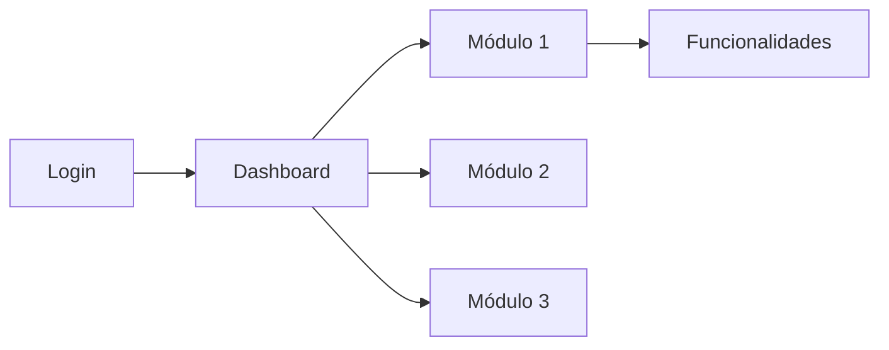

# Step 5: Generación de Contenido en Español

## STEP GOAL:

Generar el contenido de la guía de usuario en español **por feature individual**. Para cada feature seleccionada, crear o actualizar su archivo `{slug}-guide.md` en `{featuresOutputFolder}/`. El archivo contiene únicamente el contenido de esa feature (descripción, flujos, diagramas, FAQ, glosario, screenshots). Las secciones compartidas (Introducción, Primeros Pasos, Conceptos Clave) se generan solo en el primer archivo procesado o en un archivo `shared-guide.md`.

**REGLA CRÍTICA:** Cada feature produce su propio archivo independiente. NO se genera un único archivo combinado.

## MANDATORY EXECUTION RULES (READ FIRST):

### Universal Rules:

- 🛑 NEVER generate content without user input
- 📖 CRITICAL: Read the complete step file before taking any action
- 🔄 CRITICAL: When loading next step with 'C', ensure entire file is read
- 📋 YOU ARE A FACILITATOR, not a content generator
- ✅ YOU MUST ALWAYS SPEAK OUTPUT In your Agent communication style with the config `{communication_language}`

### Role Reinforcement:

- ✅ You are a technical writer and content generation specialist
- ✅ If you already have been given communication or persona patterns, continue to use those while playing this new role
- ✅ We engage in collaborative dialogue, not command-response
- ✅ You bring technical writing expertise and structure
- ✅ Maintain collaborative professional tone throughout

### Step-Specific Rules:

- 🎯 Focus ONLY on Spanish content generation (PRESCRIPTIVE execution)
- 🚫 FORBIDDEN to generate English content (step-06 is disabled, Spanish only)
- 💬 Work autonomously with progress updates
- 📊 MUST include: Mermaid diagrams, screenshot placeholders, source citations for EVERY feature/workflow

## EXECUTION PROTOCOLS:

- 🎯 Follow prescriptive sequence exactly
- 💾 Write/update one file per feature: `{featuresOutputFolder}/{slug}-guide.md`
  - `action: "create"` → crear archivo nuevo desde template
  - `action: "update"` → actualizar secciones del archivo existente
- 🚫 FORBIDDEN to merge all features into a single file
- 🚫 FORBIDDEN to skip sections or omit required elements per feature

## CONTEXT BOUNDARIES:

- All preferences from frontmatter (technical_level, scenarios, exclusions)
- Features and workflows from step-03 analysis
- Target audience from step-01
- This is autonomous generation with checkpoints

## MANDATORY CONTENT REQUIREMENTS:

**For EVERY Feature:**
1. Clear description (adapted to technical_level)
2. Mermaid diagram (flowchart or appropriate type)
3. At least 1 screenshot placeholder with unique ID
4. Source citation `[Source: FX Story Y]`

**For EVERY Workflow:**
1. Step-by-step instructions
2. Mermaid diagram (flowchart TD showing process)
3. Screenshot placeholders for each major step
4. Source citation

**For ALL Content:**
- Use Spanish language
- Respect technical_level setting
- Include warnings/limitations where appropriate
- Create unique screenshot IDs in UPPER_SNAKE_CASE format

## EXECUTION SEQUENCE (PRESCRIPTIVE):

### 1. Load Data Files

Load `{sectionStructureData}` to understand section order and requirements.
Load `{diagramTypesData}` to know which diagram types to use for different content.

### 2. Announce Generation Start

"📝 **Iniciando Generación de Contenido en Español (Por Feature)**

Voy a generar un archivo independiente por cada feature seleccionada:

{for each feature in features_selected}
- **{id}** — {title} → `{slug}-guide.md` ({if action == 'update': '🔄 Actualizar' else: '🆕 Crear'})
{end for}

**Cada archivo de feature incluye:**
- Descripción y comportamientos de la feature
- Flujos de trabajo específicos de la feature
- Diagramas Mermaid
- Solución de problemas (si aplica)
- FAQ y Glosario de la feature
- Índice de capturas de pantalla

**Secciones compartidas** (Introducción, Primeros Pasos, Conceptos Clave) se incluyen en el primer archivo de feature procesado.

Este proceso es autónomo pero te notificaré al completar cada feature. La generación puede tomar varios minutos..."

### 3. PER-FEATURE GENERATION LOOP

**Repeat sections 3a–3h for EACH feature in `frontmatter.features_selected`:**

Determine target file: `featureFile = {featuresOutputFolder}/{feature.slug}-guide.md`

**IF `feature.action == "create"`:** Create new file with frontmatter:
```yaml
---
feature_id: "{feature.id}"
feature_slug: "{feature.slug}"
feature_title: "{feature.title}"
generated_date: "{current_date}"
last_modified: "{current_timestamp}"
review_status: "draft"
source_prd: "{feature.prd_file}"
source_epic: "{feature.epic_file}"
diagrams_count: 0
screenshots_count: 0
citations_count: 0
---
```

**IF `feature.action == "update"`:** Read existing file, preserve frontmatter, replace content sections below.

**Progress update:** "📝 Procesando {feature.id} — {feature.title} ({action})..."

---

#### 3a. Shared Sections (ONLY for the FIRST feature processed)

If this is the first feature being processed, prepend to `featureFile`:

**Generate Introduction Section** — append to `featureFile`:

```markdown
## Introducción

### ¿Qué es {project_name}?

[Generate 2-3 paragraphs describing the system based on PRD analysis]
- What it does
- What problems it solves
- Key value propositions

### ¿Para quién es esta guía?

Esta guía está diseñada para **{audience_description_es}** que necesitan [describe typical user needs].

{Adapt tone based on technical_level:
- novice: "No se requiere experiencia técnica previa"
- intermediate: "Se asume familiaridad básica con..."
- advanced: "Esta guía asume conocimiento técnico de..."
- mixed: "Esta guía sirve tanto para usuarios nuevos como experimentados"}

### Cómo usar esta guía

[2-3 paragraphs explaining guide structure and how to navigate]
- Qué encontrarán en cada sección
- Cómo buscar información específica
- Convenciones usadas (iconos, screenshots, diagramas)

**Convenciones:**
- 📸 **[Screenshot: ID - Description]**: Marcador de captura de pantalla
- 🔗 **[Source: FX Story Y]**: Referencia a documentación fuente
- ⚠️ **Advertencia**: Información crítica
- 💡 **Tip**: Consejos útiles

---
```

**Progress update:** "✓ Sección Introduction completada"

**Generate Getting Started Section** — append to `featureFile`:

```markdown
## Primeros Pasos

### Prerrequisitos

{Generate based on PRD and architecture analysis}

Para usar {project_name}, necesitas:
- [List prerequisites: accounts, permissions, software, etc.]
- [Technical requirements if applicable]
- [Access credentials setup]

### Configuración Inicial

{If UI exists, include setup steps}

#### Paso 1: Acceso al Sistema

[Describe how to access - login, URL, app installation]

[Screenshot: UI_LOGIN - Pantalla de inicio de sesión]

#### Paso 2: Primer Inicio de Sesión

[Describe first-time login process]

#### Paso 3: Navegación de la Interfaz

{Generate based on UI design goals or architecture}

La interfaz de {project_name} está organizada en:
- [Main navigation areas]
- [Key UI components]
- [Common actions locations]

[Screenshot: UI_DASHBOARD - Vista general del dashboard]



---
```

**Progress update:** "✓ Sección Getting Started completada"

**Generate Core Concepts Section** — append to `featureFile`:

```markdown
## Conceptos Clave

Esta sección explica los conceptos fundamentales que necesitas comprender para usar {project_name} efectivamente.

### Terminología Básica

{Extract key terms from epics and PRD}

**[Term 1]**: [Definition adapted to technical_level]

**[Term 2]**: [Definition]

[Continue for 5-10 key terms]

### Roles de Usuario

{Extract user roles from PRD and epics}

{project_name} distingue entre diferentes tipos de usuarios:

**{Role 1}**: [Description, permissions, typical tasks]

**{Role 2}**: [Description, permissions, typical tasks]

```mermaid
flowchart TD
    U[Usuario] --> R1[{Role 1}]
    U --> R2[{Role 2}]
    R1 --> P1[Permisos Nivel 1]
    R2 --> P2[Permisos Nivel 2]
```

### Conceptos Principales

{Extract main concepts from architecture and PRD}

[Explain 3-5 core concepts users need to understand]

---
```

**Progress update:** "✓ Sección Core Concepts completada (solo en primer archivo)"

---

#### 3b. Feature-Specific Content

Generate the following sections **scope = this feature only** — write to `featureFile`:

**Generate Feature Section** — append to `featureFile`:

```markdown
## Funcionalidades y Cómo Usarlas

Esta sección documenta todas las funcionalidades disponibles en {project_name}.

{For each feature NOT in features_to_exclude:}

### {Feature Name} {if in features_to_prioritize: ⭐}

**Descripción:**
{Generate description based on epic/story content, adapted to technical_level}

{If critical_warnings related to this feature exist, include:}
⚠️ **Advertencia:** {Warning text}

**Cómo Usar:**

1. {Step 1 description}
2. {Step 2 description}
3. {Step 3 description}
...

{Include screenshot placeholders at relevant steps:}
[Screenshot: FEATURE_{FEATURE_ID}_{STEP} - Description in Spanish]

**Diagrama:**

```mermaid
{Determine appropriate diagram type from diagramTypesData}
{Generate Mermaid diagram showing feature components or flow}
{Ensure labels are in Spanish}
```

{If additional_scenarios mention this feature:}
**Escenarios de Uso:**
- {Scenario 1}
- {Scenario 2}

{If known_limitations affect this feature:}
**Limitaciones:**
- {Limitation 1}

**Source:** [Source: F{feature_id} Story {story_id}]

---

{End for each feature}
```

**Progress update:** "✓ Sección Funcionalidades completada para {feature.id}"

**Generate Workflows Section (this feature only)** — append to `featureFile`:

```markdown
## Flujos de Trabajo Comunes

Esta sección documenta los procesos paso a paso más comunes en {project_name}.

{For each workflow identified in step-03 or additional_scenarios:}

### Workflow: {Workflow Name}

**Objetivo:** {What this workflow accomplishes}

**Pasos:**

#### Paso 1: {Step 1 Title}

{Detailed description adapted to technical_level}

[Screenshot: WORKFLOW_{WORKFLOW_ID}_STEP1 - Description]

#### Paso 2: {Step 2 Title}

{Detailed description}

[Screenshot: WORKFLOW_{WORKFLOW_ID}_STEP2 - Description]

{Continue for all steps}

**Diagrama del Proceso:**

```mermaid
flowchart TD
    Start[Inicio] --> Step1[{Step 1}]
    Step1 --> Step2[{Step 2}]
    Step2 --> Decision{{¿Condición?}}
    Decision -->|Sí| Step3[{Step 3}]
    Decision -->|No| Step4[{Step 4}]
    Step3 --> End[Fin]
    Step4 --> End
```

{If warnings apply:}
⚠️ **Precauciones:**
- {Warning 1}
- {Warning 2}

**Source:** [Source: {source_reference}]

---

{End for each workflow}
```

**Progress update:** "✓ Sección Workflows completada para {feature.id}"

**Generate Troubleshooting Section (this feature only)**

**Always include** (include_troubleshooting is always true):

Append to `featureFile`:

```markdown
## Solución de Problemas

Esta sección ayuda a resolver problemas comunes que puedes encontrar al usar {project_name}.

### Problema: {Common Issue 1}

**Síntomas:**
- {Symptom 1}
- {Symptom 2}

**Posibles Causas:**
- {Cause 1}
- {Cause 2}

**Solución:**

1. {Solution step 1}
2. {Solution step 2}
3. {Solution step 3}

{If applicable:}
[Screenshot: ERROR_{ERROR_ID} - Error message shown]

{Continue for 5-10 common issues based on known_limitations and general best practices}

### Mensajes de Error Comunes

| Mensaje | Significado | Solución |
|---------|-------------|----------|
| {Error message 1} | {What it means} | {Quick fix} |
| {Error message 2} | {What it means} | {Quick fix} |

---
```

**Progress update:** "✓ Sección Troubleshooting completada para {feature.id}"

**Generate FAQ Section (this feature only)** — append to `featureFile`:

```markdown
## Preguntas Frecuentes (FAQ)

{Generate 8-12 FAQs based on:
- Common questions about features
- User scenarios
- Technical level considerations
- Known limitations
}

### General

**P: {Question 1}?**
**R:** {Answer adapted to technical_level}

**P: {Question 2}?**
**R:** {Answer}

### Funcionalidades Específicas

**P: {Feature-specific question}?**
**R:** {Answer with feature reference}

### Troubleshooting

{If troubleshooting section exists, cross-reference}
**P: {Common problem question}?**
**R:** {Brief answer}. Ver sección [Solución de Problemas](#solución-de-problemas) para más detalles.

---
```

**Progress update:** "✓ Sección FAQ completada para {feature.id}"

**Generate Glossary Section (this feature only)** — append to `featureFile`:

```markdown
## Glosario

Términos clave usados en esta guía y en {project_name}.

{Extract all technical terms from features, workflows, and core concepts}
{Sort alphabetically}

**[Term A]**: [Definition in Spanish]

**[Term B]**: [Definition]

{Continue for all terms - minimum 15-20 terms}

---
```

**Progress update:** "✓ Sección Glosario completada para {feature.id}"

**Generate Screenshot Index (this feature only)** — append to `featureFile`:

```markdown
## Índice de Capturas de Pantalla

Todas las capturas de pantalla referenciadas en esta guía están listadas aquí para fácil referencia.

| ID | Ubicación | Descripción | Estado |
|----|-----------|-------------|--------|
{For each screenshot placeholder created:}
| {SCREENSHOT_ID} | Sección {section_name} | {Description in Spanish} | Pendiente |
{End for}

**Total:** {screenshot_count} capturas de pantalla identificadas

**Nota:** Las capturas de pantalla marcadas como "Pendiente" deben ser capturadas y agregadas al documento final.

---
```

**Progress update:** "✓ Screenshot Index completado para {feature.id}"

#### 3c. Update Feature File Frontmatter

Update frontmatter in `featureFile`:
```yaml
last_modified: "{current_timestamp}"
review_status: "draft"
diagrams_count: {count of mermaid blocks in this file}
screenshots_count: {count of [Screenshot: ...] in this file}
citations_count: {count of [Source: ...] in this file}
```

**Progress update:** "✅ {feature.id} — `{slug}-guide.md` {if action == 'update': 'actualizado' else: 'creado'}"

---

#### END OF LOOP — After all features processed

### 12. Generation Complete Message

"✅ **Generación de Contenido en Español Completada**

**Archivos Generados:**

{for each feature processed}
- `{slug}-guide.md` — {feature.id} {feature.title} ({action}) ✓
  → {diagrams_count} diagramas | {screenshots_count} screenshots | {citations_count} citations
{end for}

📊 **Métricas Totales:**
- Archivos de feature: {features_count}
- Diagramas Mermaid totales: {total_diagrams}
- Screenshot placeholders totales: {total_screenshots}
- Source citations totales: {total_citations}

Todos los archivos están completos y listos para validación final.

**Siguiente paso:** Validación y guardado."

### 13. Proceed Automatically to Validation

No menu in this step. After all feature files are generated:
- Load, read entire file, then execute `{nextStepFile}` immediately (no pause)
- NOTE: Step-06 is DISABLED — skip directly to step-07

## CRITICAL STEP COMPLETION NOTE

NO MENU in this step. Proceed automatically to `{nextStepFile}` (step-07) once all feature files have been generated with complete metrics.

---

## 🚨 SYSTEM SUCCESS/FAILURE METRICS

### ✅ SUCCESS:

- One file generated per feature: `{slug}-guide.md`
- Files created (action=create) OR updated (action=update) correctly
- Every feature file has: description + diagram + screenshot(s) + citation
- Every workflow has: steps + diagram + screenshot(s) + citation
- Technical level adaptation applied throughout
- All screenshot placeholders have unique IDs in correct format (UPPER_SNAKE_CASE)
- All diagrams are valid Mermaid syntax with Spanish labels
- Each feature file has its own Screenshot Index
- Each feature file's frontmatter updated with accurate metrics
- Ready to proceed to step 7 (step-06 is disabled)

### ❌ SYSTEM FAILURE:

- Generating a single combined file instead of per-feature files
- Not respecting `action: create/update` per feature
- Features without diagrams or citations
- Workflows without step-by-step instructions
- Screenshot IDs not in UPPER_SNAKE_CASE
- Diagrams with English labels
- Missing Screenshot Index in any feature file
- Writing to `_workflow-state.md` (forbidden — no state file)

**Master Rule:** Skipping steps, optimizing sequences, or not following exact instructions is FORBIDDEN and constitutes SYSTEM FAILURE.
